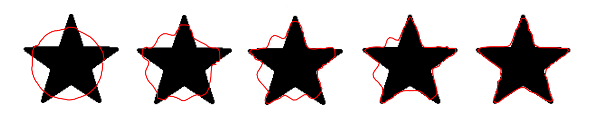

 

# Active Contour Segmentation

In this project I wanted to gain experience in a multi-language project, mixing a Python front-end with a C++ calculation core. For this project I chose Active Contour segmentation also known as Snakes. This lends itself especially well as we need to load images and initialize a contour which is easily done in Python and an iterative optimization that can be done efficiently in C++.

## Table of Contents

- [Installation](#installation)
- [Usage](#usage)
- [Multi-language](#multi-language)
- [Active Contours (Nice Math)](#active-contour-model)
- [References](#references)

## Installation

Build the C++ library as defined in the CMakeLists.txt. This way you can call the .dll/.so file

## Multi-language

Currently this project is based on a C++ core together with a python UI, that makes it easy to load images and draw initial shapes.

## Active Contour Model

The active contour model states the segmentation problem as an energy minimization. Where we have a contour $s$ where $s \mapsto v(s) = (x(s), y(s))$ (with periodic boundary conditions, $v(1) = v(0)$).

$$E(s)=\int_{0}^{1}E_{int}(s) + E_{ext}(s)ds$$

Here, $E_{int}$ represents the internal energy, and $E_{ext}$ represents the external energy (note that the contour is assumed to be closed over the interval of integration). $E_{ext}$ can also be called the image energy; this can be seen as a potential field as we know it from mechanics. If we want to find the edge of an object we can state the external energy as the gradient of the original image, which can be stated as,

$$E_{ext}(s) = -P(v(s)) =-\left|\left| \frac{\partial I(x,y)}{\partial x}, \frac{\partial I(x,y)}{\partial y} \right|\right|^{2}$$

In practice this is calculated using a Sobel or Canny edge detection filter.

The internal energy $E_{int}$ can be seen as a regularization term that keeps the contour a "physical" line instead of a loose collection of points, and can be written as

$$E_{int}(s) = \frac{1}{2} (\alpha ||v^{,}(s)||^2 + \beta ||v(s)^{''}||^2)$$

Combining all this we can write the problem as such,

$$\underset{s}{\min} \int_{0}^{1} G(s,v^{,}(s),v^{,,}(s)) ds $$

where $G(s)$ is the combined internal and external energy.

## Greedy Snake 

The greedy snake is the most naive implementation to solve the energy minimization. For every point in the contour we see how the energy would change if we would move it to one of its neighboring grid points. This is then repeated for every point. This works but is not as fast and is prone to get stuck in a local minimum. 

## Euler-Lagrange solver  

A more advanced way to solve this energy minimization problem is to borrow the Euler-Lagrange equation from the field of classical mechanics. 
Using the Euler-Lagrange equation we can restate our energy minimization problem as such.

$$\min_{v} \int_{0}^{1} G(s, v, v', v'') \, ds \iff \frac{\partial G}{\partial v} - \frac{\partial}{\partial s} \frac{\partial G}{\partial v'} + \frac{\partial^2}{\partial s^2} \frac{\partial^2 G}{\partial v''} = 0$$

So for our problem this results in the following components.

$$\frac{\partial G}{\partial v} = -\nabla(P(v(s))), \quad \frac{\partial}{\partial s} \frac{\partial G}{\partial v'} = \alpha v^{(2)}(s), \quad \text{and} \quad \frac{\partial^2}{\partial s^2} \frac{\partial^2 G}{\partial v''} = \beta v^{(4)}(s)$$

Combining all this we can see that the snake that minimizes our energy functional must follow:

$$ \quad \alpha v^{(2)}(s) - \beta v^{(4)}(s) - \nabla(P(v(s))) = 0$$

## References

[1] Pierre, F., et al. "Segmentation with Active Contours," in Image Processing On Line, vol. 11, pp. 120–141, 2021.
