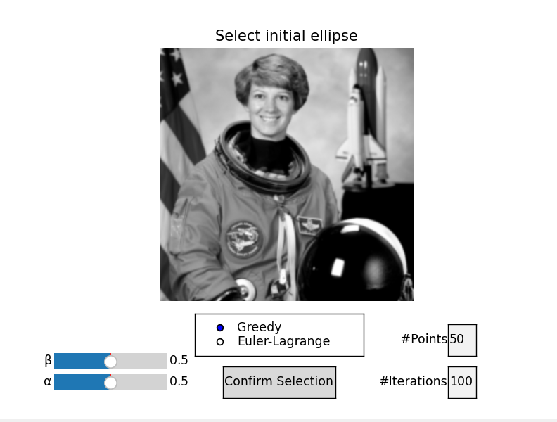
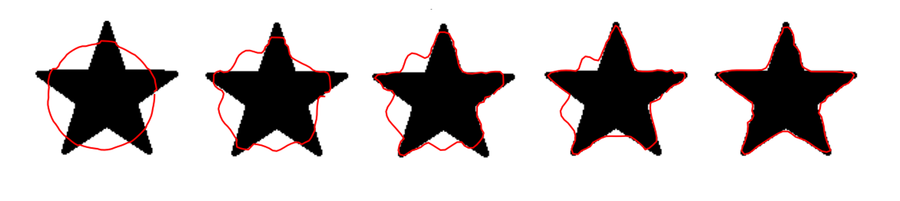

[](https://github.com/Samuel-van-Gurp/CPP-Python-Package/actions/workflows/c-cpp.yml) 
[](https://codecov.io/github/Samuel-van-Gurp/CPP-Python-Package)
[](https://github.com/Samuel-van-Gurp/CPP-Python-Package/actions/workflows/publish-pypi-test-env.yml)
[](https://github.com/Samuel-van-Gurp/CPP-Python-Package/actions/workflows/wheels.yml)
# Active Contour Segmentation

In this project, I wanted to gain experience with a multi-language codebase, mixing a Python front end with a C++ computational core. I chose Active Contour segmentation, also known as Snakes. This is a good fit because loading images and initializing a contour is easy in Python, while the iterative optimization is efficient in C++.

## Table of Contents

- [Prerequisites](#prerequisites)
- [Installation](#installation)
- [Usage](#usage)
- [CI/CD](#cicd)
- [Multi-language](#multi-language)
- [Active Contour Model](#active-contour-model)
- [References](#references)

## Installation

The package is hosted on the [TestPyPI environment](https://test.pypi.org/project/SnakesPy/). To install it, run the following command:

```cmd
pip install -i https://test.pypi.org/simple/ SnakesPy
```

Please refer to `requirements.txt` for Python dependencies.

Wheels are not built for every platform yet, but some versions are currently available for Windows, macOS, and Linux ([see files](https://test.pypi.org/project/SnakesPy/#files)).

## Usage

To run the program, install the package in your environment and run:

```cmd
python -m SnakesPy.test_api "path\to\your\image.png"
```

This opens a pop-up window where you can draw an initial shape to evolve and set the model parameters and solver.


## CI/CD

This repository uses GitHub Actions for testing, wheel building, release uploads, and TestPyPI publishing.

### 1. C++ test pipeline (`c-cpp.yml`)
Builds the C++ project and runs the test suite.

### 2. Wheel build pipeline (`wheels.yml`)
- Builds wheels via `cibuildwheel` on:
	- `ubuntu-latest` (`x86_64`)
	- `windows-latest` (`AMD64`)
	- `macos-latest` (`universal2`)
- Uploads built wheels as GitHub Actions artifacts

### 3. Upload wheels to GitHub Release (`wheels.yml` -> `upload_to_release`)
- Runs only after wheel build succeeds
- Runs only for tag builds or manual dispatch
- Downloads all wheel artifacts and uploads them to the matching GitHub Release via `gh release upload`

### 4. Publish to TestPyPI (`publish-pypi-test-env.yml`)

- Triggered by completion of the `Build Wheels` workflow (`workflow_run`)
- Downloads wheel artifacts from the triggering workflow and publishes them to TestPyPI (`https://test.pypi.org/legacy/`)

## Project layout

- `cpp_code/`: C++ core implementation, pybind11 bindings, and C++ tests.
- `python_code/SnakesPy/`: Python package (UI, API wrappers).
- `.github/workflows/`: CI/CD workflows for tests, wheels, and TestPyPI publish.
- `pyproject.toml`: Packaging and build configuration (scikit-build + CMake).

## Multi-language

Currently, this project is based on a C++ core together with a Python UI, which makes it easy to load images and draw initial shapes. The connection between Python and C++ is implemented using [Pybind11](https://pybind11.readthedocs.io/en/stable/). This tool compiles the C++ code into a Python extension module, which can then be imported by the Python package.

## Active Contour Model

The active contour model formulates segmentation as an energy minimization problem. We start with an initial contour that evolves to a (locally) minimum-energy state.



Let `s` parameterize the contour such that `s -> v(s) = (x(s), y(s))`, with periodic boundary conditions `v(1) = v(0)`.

$$E(s)=\oint E_{int}(s) + E_{ext}(s)ds$$

Here, $E_{int}$ represents the internal energy, and $E_{ext}$ represents the external energy (note that the contour is assumed to be closed over the interval of integration). $E_{ext}$ can also be called the image energy; this can be seen as a potential field as we know it from mechanics. If we want to find the edge of an object we can state the external energy as the gradient of the original image, which can be stated as,

$$E_{ext}(s) = -P(v(s)) =-\left|\left| \frac{\partial I(x,y)}{\partial x}, \frac{\partial I(x,y)}{\partial y} \right|\right|^{2}$$

In practice this is calculated using a Sobel or Canny edge detection filter.

The internal energy $E_{int}$ can be seen as a regularization term that keeps the contour a "physical" line instead of a loose collection of points, and can be written as

$$E_{int}(s) = \frac{1}{2} (\alpha ||v^{,}(s)||^2 + \beta ||v(s)^{,,}||^2)$$

Combining all this we can write the problem as such,

$$\underset{s}{\min} \oint G(s,v^{,}(s),v^{,,}(s)) ds $$

where $G(s)$ is the combined internal and external energy.

## Greedy Snake 

The greedy snake is the most naive implementation for solving this energy minimization problem. For each point on the contour, it evaluates how the energy changes if the point moves to one of its neighboring grid points. This process is repeated for every point. It works, but it is slower and more prone to getting stuck in a local minimum.

## Euler-Lagrange solver  

A more advanced way to solve this energy minimization problem is to use the Euler-Lagrange equation from classical mechanics.
Using the Euler-Lagrange equation we can restate our energy minimization problem as such.

$$\min_{v} \oint G(s, v, v^{,}, v^{,,}) \, ds \iff \frac{\partial G}{\partial v} - \frac{\partial}{\partial s} \frac{\partial G}{\partial v'} + \frac{\partial^2}{\partial s^2} \frac{\partial^2 G}{\partial v''} = 0$$

So for our problem this results in the following components.

$$\frac{\partial G}{\partial v} = -\nabla(P(v(s))), \quad \frac{\partial}{\partial s} \frac{\partial G}{\partial v'} = \alpha v^{(2)}(s), \quad \text{and} \quad \frac{\partial^2}{\partial s^2} \frac{\partial^2 G}{\partial v''} = \beta v^{(4)}(s)$$

Combining all this we can see that the snake that minimizes our energy functional must follow:

$$ \quad \alpha v^{(2)}(s) - \beta v^{(4)}(s) - \nabla(P(v(s))) = 0$$

This equation is solved numerically using the Euler method.

## References

[1] Pierre, F., et al. "Segmentation with Active Contours," in Image Processing On Line, vol. 11, pp. 120–141, 2021.
